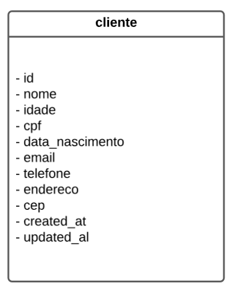

# MVP - Cadastro de Pessoa Fisisca

Este é um projeto  de desenvolvido para o desafio tecnico da empresa NeoApp
O desafio conssite em criar uma API REST para o cadastro de  pessoa fisisca, sendo possível realizar um crude completo.

## Requisitos do desafio tecnico
- [x] Permita inclusão de novos cliente. 
- [x] Permita a atualização de cliente existentes.  
- [x] Permita a exclusão de cliente existentes. 
- [x] Permita a listagem dos cliente de forma paginada. 
- [x] Permita buscas por atributos cadastrais do cliente. 
- [x] É necessário também que cada elemento retornado pela API contenha (além das informações de cadastro) a idade calculada a partir da data de nascimento. 
- [x] Utilize Swagger para documentação/especificação da API.
- [ ] Utilize Spring Security e JWT para segurança da aplicação. 
- [x] Utilize Spring Data JPA para abstração da camada de acesso a dados. Critérios que iremos utilizar para avaliar o seu Desafio Técnico: 
- [x] Utilização de boas práticas de código. 
- [x] Utilização de padrões de projeto. 
- [ ] Cobertura de testes (Unitários, Integrados e/ou de comportamento). 
- [x] Design de API REST. 
### Bônus - Para ir além das expectativas, desenvolva os itens abaixo, conforme sentir necessidade: 
- [ ] Empacote sua aplicação com Docker. 
- [ ] Hospede o projeto em algum provedor cloud e forneça por email a URL para acesso. 
- [x] Validação de Cep, cpf e email via Bean.
- [x] Utilização do Lombok para reduzir boilerplate code.
- [ ] Utilização do SLF4J para logs.
- [x] Tratamento de Exceções Globais.
- [x] Utilização de DTOs para requisições e respostas.
- [x] Utilização de Profiles para separar configuração de desenvolvimento e produção.
- [x] Requisção para api ``viaCep`` externa para validação de cep.

## Tecnologias Utilizadas
- Java
- Spring Boot 
- Spring Data JPA
- Spring Security 
- JWT 
- Swagger
- Docker.


## Fluxo de desenvolvimento 
### Estrutura do Projeto
- O projeto utiliza tecnologias como Java, Spring Boot, Spring Data JPA, Spring Security, JWT, Swagger e Docker. Onde já possuo varios projetos desenvolvidos utilziando essa tecnologias. A ideia vai ser
unir dois projetos que ja possuo, um unico. 
- A API REST será desenvolvida com base no projeto [LavPay](https://github.com/3vinicius/lavpay-api), que é um sistema de gestão para lava jatos. 
- Utilizaremos o a imagem docker do openjdk:21-jdk-slim, que é uma imagem leve, open source para aplicações Java.
- Além do especificado no desafio tecnico, a API REST usará o lombok para reduzir reduzir a quantidade de codigo e facilitar no mapeamento entre entidades e DTOs e o slf4j para log.
-  Para proteger os recursos da API o arquivo de configuração estará dividido em dois tipos um de produção e outro de desenvolvimento, onde o de desenvolvimento.
- Também será utilizado o um default sql para subir as tabelas necessarias e da a carga na aplicação.
- A imagem abaixo mostra o diagrama UML das entidades do baco

- Resolvi cadastrar a idade do cliente no banco de dados para evitar o calculo toda vez que for buscar todos os cliente
- Ao cadastrar ou atilizar o cliente a idade sera calculada com a função `geradorDeIdade` e salva no banco de dados.
```java
 private Integer geradorDeIdade(LocalDate dataNascimento) {
        LocalDate dataAtual = LocalDate.now();
        return  Period.between(dataNascimento, dataAtual).getYears();
    }
```
Essa função pega a diferença entre a data atual e a data de nascimento e retorna a idade em anos.

- A validação do CPF, CEP , email e telefone será feita via Bean Validation utilizando as anotações `@CPF`, `@Email` e `@Pattern` respectivamente.
- A validação do CEP será feita com a seguinte regex `^\d{5}-\d{3}$` que valida o formato `12345-678` além disso será utilizado uma api de validação `via Cep` para garantir que o cep existe.

## Funcionalidades Planejadas
- Cadastro de cliente.
- Gerenciamento de vendas e serviços.
- Relatórios de desempenho e faturamento.
- Autenticação e autorização de usuários.

## Como Participar
1. **Entre no nosso Discord:** Participe da comunidade para se comunicar com outros colaboradores.
2. **Acesse o Redmine:** Veja as tarefas disponíveis e escolha uma para contribuir.
3. **Contribua:** Faça um fork do repositório, desenvolva sua funcionalidade e envie um pull request.

## Estrutura do Projeto
- **lavpay-api:** API REST desenvolvida com Spring Boot.
- **lavpay-web:** Aplicação frontend desenvolvida com Angular.
- **docker-compose:** Configuração para rodar o ambiente completo com Docker.

## Requisitos para Contribuir
- Conhecimento básico em Java, Spring Boot ou Angular.
- Familiaridade com Git e GitHub.
- Vontade de aprender e colaborar.

## Contato
- **Discord:** [Link para o servidor](https://discord.gg/W4U763VzFK)
- **Repositório GitHub:** [Link para o repositório](https://github.com/3vinicius/lavpay-api)


## Licença
Este projeto está licenciado sob a [MIT License](LICENSE).
