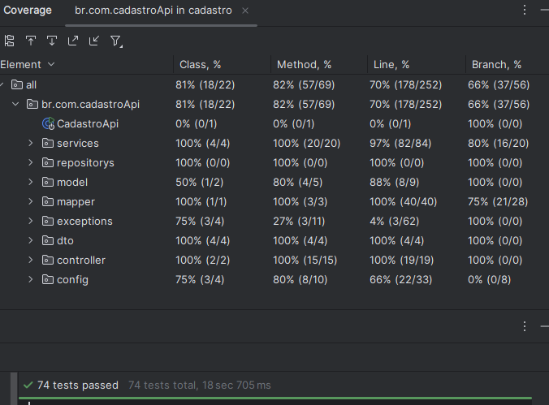

# MVP - Cadastro de Pessoa Fisisca

Este projeto foi desenvolvido para o desafio técnico da empresa NeoApp

O desafio consiste em criar uma API REST para o cadastro de pessoa fisisca, seguindo os requisitos abaixo.

---
## Requisitos do desafio técnico
- ✅ Permita inclusão de novos cliente. 
- ✅ Permita a atualização de cliente existentes.  
- ✅ Permita a exclusão de cliente existentes. 
- ✅ Permita a listagem dos cliente de forma paginada. 
- ✅ Permita buscas por atributos cadastrais do cliente. 
- ✅ É necessário também que cada elemento retornado pela API contenha (além das informações de cadastro) a idade calculada a partir da data de nascimento. 
- ✅ Utilize Swagger para documentação/especificação da API.
- ✅ Utilize Spring Security e JWT para segurança da aplicação. 
- ✅ Utilize Spring Data JPA para abstração da camada de acesso a dados. Critérios que iremos utilizar para avaliar o seu Desafio Técnico: 
- ✅ Utilização de boas práticas de código. 
- ✅ Utilização de padrões de projeto. 
- ✅ Cobertura de testes (Unitários, Integrados e/ou de comportamento). 
- ✅ Design de API REST. 
### Bônus  
- ✅ Empacote sua aplicação com Docker. 
- ✅ Hospede o projeto em algum provedor cloud e forneça por email a URL para acesso. 
### Extras
- ✅ Validação de CEP, CPF e e-mail via Bean Validation.
- ✅ Utilização do Lombok para reduzir boilerplate code.
- ✅ Tratamento de exceções.
- ✅ Utilização de DTOs para requisições e respostas.
- ✅ Utilização de Profiles para separar configuração de desenvolvimento e produção.
- ✅ Utilização de um script SQL para criação das tabelas e carga inicial de dados.
- ✅ Requisição para API `viaCep` externa para validação de CEP.

## Tecnologias Utilizadas
- Java
- Spring Boot 
- Spring Data JPA
- Spring Security 
- JWT 
- Swagger
- Docker
- Postgres

---

## Fluxo de desenvolvimento 

### Banco de Dados
- O banco está em um container Docker na mesma VPS da aplicação.
- O arquivo `default.sql` contém a estrutura do banco de dados e os scripts utilizados para carga inicial da aplicação.
- A imagem abaixo mostra o diagrama UML da tabela de **Cliente**:  
  

- Além da tabela de cliente, há a tabela de **Usuarios**,  entidade responsável pela autenticação:  
  


### Requisito Funcional do Desafio
- Ao cadastrar ou atualizar a data de nascimento do cliente a idade sera calculada com a função `obterIdadePorNascimento` e salva no banco de dados.
```java
    private Integer obterIdadePorNascimento(LocalDate dataNascimento) {
    LocalDate dataAtual = LocalDate.now();

    Period diferencaDatas = Period.between(dataNascimento, dataAtual);

    if (diferencaDatas.getYears() >= 0 && diferencaDatas.getMonths() >= 0 && diferencaDatas.getDays() >= 0 ) {
        return  diferencaDatas.getYears();
    } else {
        throw new DataInvalidaException("Data de nascimento inválida. A data de nascimento não pode ser no futuro.");
    }
}

```
Essa função pega a diferença entre a data atual e a data de nascimento e retorna a idade em anos. Caso a data nascimento seja maior que a data atual então ele deve lançar uma exception

### Testes
- Teste unitários para os services e dtos. Nesses testes exploramos diferentes comportamentos em cada unidade da aplicação. Forçando comportamento para lançar exceções. 
- Teste de Integração para o controller. Nesses testes é explorado o "fluxo comum" da aplicação
- Conforme os dados de cobertura foram realizados 74 casos de teste, cobrindo cerca de 81% do código. O Foco destes testes foi a parte mais lógica da aplicação, que seria os serviços e validações:
   

- Uma classe foi criada para facilitar a criação de objetos:
  

### Docker
- Foi utilizado a imagem docker do openjdk:21-jdk-slim, que é uma imagem leve, open source para rodar aplicações Java.
- Configurei um DockerFile para usar a imagem openjdk:21-jdk-slim e copiar e executar o jar da aplicação.
- Usei o docker compose para configurar o container. 

### Spring Security + JWT
-  Apenas usuarios cadastrados no banco de dados conseguem autorização para realizar consultas nos dados.
-  Ao realizar o login será retornado um token que serve para autenticar cada requisição.

### Hospedagem
- A aplicação foi hospedada em uma VPS da Digital Oceanos. Lá também contém o banco de dados do projeto, além de outros projetos pessoais.
- A escolha pela Digital Oceanos se deve a facilidade e simplicidade de subir uma VPS na plataforma. Além de ter custo mais baixos comparados com as concorrentes.

---

## Contato
- **Repositório GitHub:** [Link para o repositório](https://github.com/3vinicius/cadastroPessoaFisica)
- **Projeto:** [Link para o projeto](http://161.35.238.60:8080/swagger-ui/index.html#/)


## Licença
Este projeto está licenciado sob a [MIT License](LICENSE).
